# 网页内容采集规则抽取工具

<!-- TOC -->

- [网页内容采集规则抽取工具](#网页内容采集规则抽取工具)
    - [简介](#简介)
    - [使用说明](#使用说明)
        - [插件安装](#插件安装)
        - [插件使用](#插件使用)
        - [服务器切换](#服务器切换)
        - [插件重启](#插件重启)
        - [插件快捷使用](#插件快捷使用)
        - [插件修改](#插件修改)
    - [项目结构](#项目结构)
        - [项目结构概览](#项目结构概览)
        - [项目文件介绍](#项目文件介绍)
            - [mainfest.json](#mainfestjson)
            - [\_locales](#\_locales)
            - [CSS](#css)
            - [Images](#images)
            - [js](#js)
            - [src](#src)
            - [popup](#popup)
            - [background.js](#backgroundjs)
            - [Main.js](#mainjs)
                - [Sdk.js](#sdkjs)
                - [tmpl.js](#tmpljs)
                - [Dom-selectors.js](#dom-selectorsjs)
                - [templates](#templates)
    - [License](#license)
    - [Contact me](#contact-me)

<!-- /TOC -->

## 简介

本项目是基于[find-selector-plugin](https://github.com/lonly197/find-selector-plugin)扩展开发的。实现了与后台实时对接，抽取网页内容采集规则，为采集系统提供快速的采集规则发现功能。

## 使用说明

### 插件安装

1. git clone https://github.com/lonly197/crawlers-plugin.git

2. 打开谷歌浏览器 -> 更多工具 -> 扩展程序

3. 勾选开发者模式， 点击加载已解压的扩展程序

   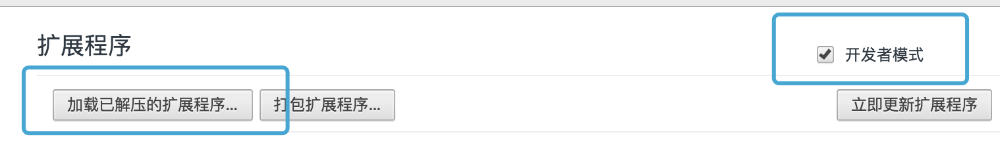

4. 选择 clone 下来的项目

   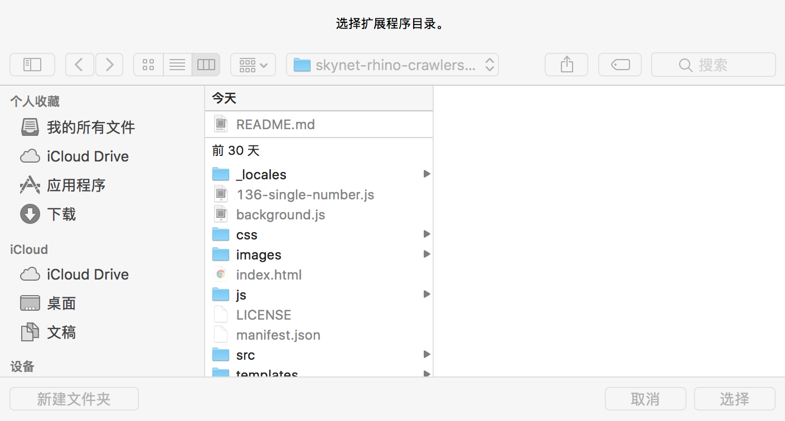

5. 浏览器工具栏会出现如下图的放大镜 icon

   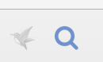

### 插件使用

1. 点击图标 ， 开始抽取页面元素

   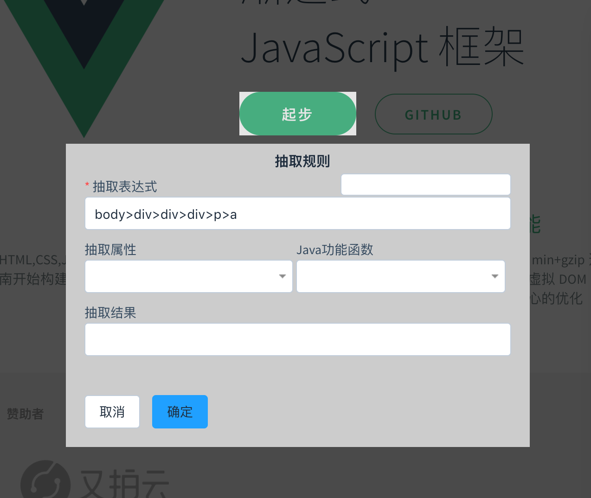

2. 点击抽取表达式的输入框，失去焦点后， 触发抽取事件，从服务器抽取具体结果

3. 等待服务器返回具体结果

   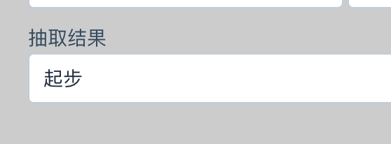

### 服务器切换

在页面在右键菜单中选择相关的服务器

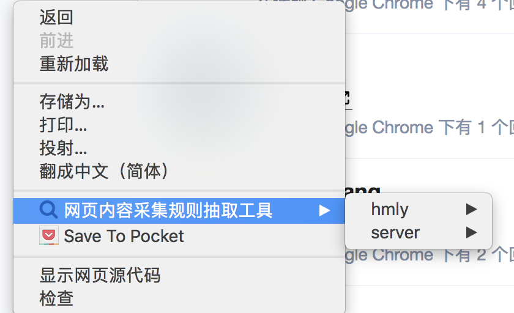

### 插件重启

1. 打开谷歌插件扩展页
2. 刷新该页面即可更新插件
3. 刷新需要使用抽取插件的页面即可刷新插入脚本

### 插件快捷使用

1. 打开谷歌插件页，拉到底部， 点击键盘快捷键

   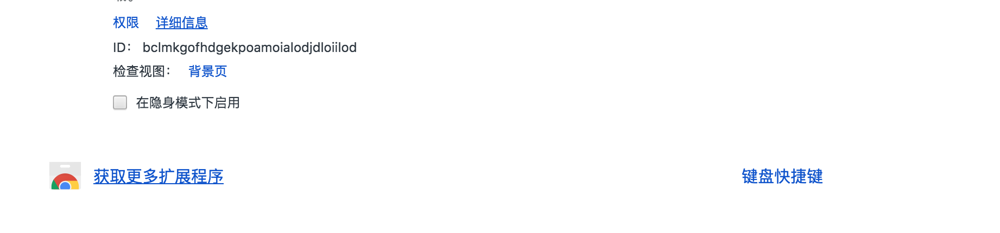

2. 自定义快捷键（注意和个人快捷键冲突）

   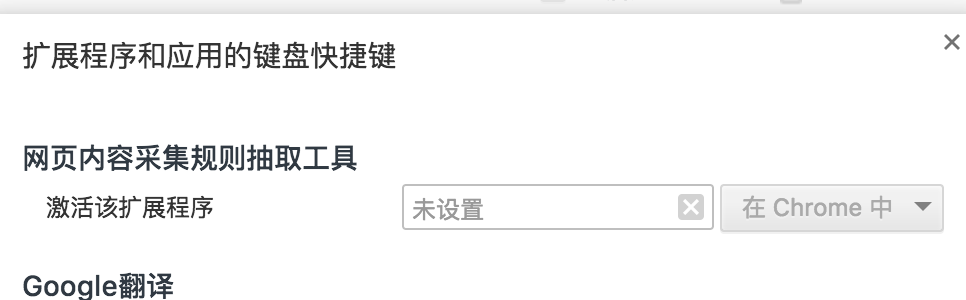

3. 重启插件，刷新页面 （参考插件重启）

   ​

另外，在插件抓取模式中，可以使用 esc 键关闭该模式.

### 插件修改

1. 添加服务器

   修改文件： background.js 的 server 数组

   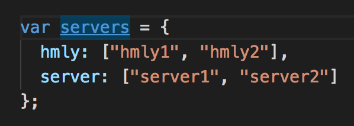

其中的字段名为服务器组，数组 item 为具体的服务器

_注意： 需要本地配置相关的 hosts 文件_

_ps: 修改 servers 之后需要重启插件，插件重启如下_

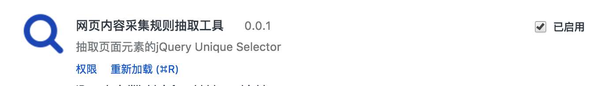

勾选 **已启用** 复选框移除插件，再次勾选重启插件

## 项目结构

### 项目结构概览

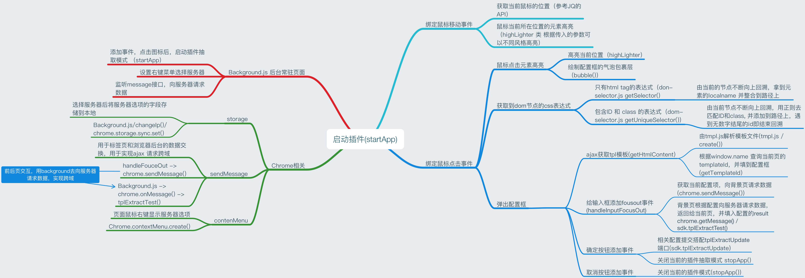

### 项目文件介绍

#### mainfest.json

该配置文件是整个插件的入口，说明如下， 详细的 API 可以参考谷歌开发者的 API

```Javascript
{
    "background": {
        "persistent": true,
        "scripts": ["background.js"]       // 常驻页面，在插件使用过程中一直在
    },
    "browser_action": {
        "default_icon": "images/css_selector_icon_128.png", // 定义插件图标
        "default_title": "Click to start"  // 定义鼠标悬浮后的插件显示名称
    },
    "content_scripts": [{    			   // 定义插入到页面中的资源文件
        "css": ["css/tooltip.css"],
        "js": ["js/jquery.js", "js/jquery-editable-select.js", "js/jquery.hotkeys.js", "/js/jquery.hoverIntent.js", "/src/dom-selector.js", "/src/highlighter.js", "/js/jquery.ct.js", "/src/sdk.js", "src/tmpl.js", "/src/clipboard.js", "/src/main.js"],
        "matches": ["http://*/*", "https://*/*"],    // 定义可供插入的匹配域名
        "all_frames": true
    }],
    "content_security_policy": "script-src 'self' 'unsafe-eval'; object-src 'self'",
      	// 定义内容的安全策略
    "description": "__MSG_extensionDescription__",
    "icons": { // 图标文件的不同size，在不同的地方使用，浏览器自动识别
        "128": "images/css_selector_icon_128.png",
        "16": "images/css_selector_icon_16.png",
        "48": "images/css_selector_icon_48.png"
    },
    "manifest_version": 2,
    "name": "__MSG_extensionName__",
    "permissions": ["activeTab", "tabs", "contextMenus", "storage", "http://hmly1:28897/", "*"],
      /** 定义用户权限
      *  其中 activeTab: 获取到当前的标签页信息
      *  tabs: 获取所有标签页信息
      *  contextMenus: 鼠标右键权限
      *  storage: 使用浏览器本地存储
      * "*": 解决跨域，即不同域的页面都可以向服务器请求资源
      */
    "version": "0.0.1",
    "author": "lonly",
    "web_accessible_resources": ["**.css", "**.html", "**.js", "**.png", "**.gif", "**.map", "templates/*"],
    "commands": {
        "_execute_browser_action": {
            "suggested_key": { "default": "Ctrl+X" },
            "description": "Stop to find the selector"
        }
    },
    "offline_enabled": false,
    // defalut language
    "default_locale": "en"    // 使用的语言文件，自动根据浏览器使用的语言环境切换语言
}
```

#### \_locales

语言包，所有的语言配置文件放在这个文件夹

目前有两个语言包 `en/message.json` 以及 `zh_CN/message.json`分别为英文，和中文，插件会自动识别浏览器使用的语言而采用相应的语言百

使用： 在 html 页面中 插入`{%=o.Name}`, 其中 Name 为具体的语言字段名

修改： message.json 中的每一个字段格式为

```json
"表示式":{
  "message": "具体的语言信息"
}
```

#### CSS

放置所有的 css 渲染文件，只有一个`tooltip.css`样式文件，用于渲染页面弹出窗口的样式

#### Images

插件的图标 以及 readme 中插入的图片

如果需要更改插件图标，修改 Images 文件夹下的 `css_selector_icon_16.png` `css_selector_icon_48.png`以及`css_selector_icon_128.png`

**PS: 如果要改图标，需要同时修改上述的三个文件，图标内容一样，并提供不同的三个尺寸**

**如果修改了图标的文件名，相应的也需要在 manifest.json 配置文件中修改相应的文件名**

#### js

jquery 等相关依赖文件

其中 jquery.js 为 jq 库，并在文件将 jq 库的全局符号绑定释放给 `_20p_$` ， 以防止误让页面原有不同版本的 jq 库，

所以，在谷歌插件的后续 js 代码中都会传入一个 `_20p_$` 用于引用 jq

Jquery.bt.js 为一个 jq 插件，用于在页面中插入具体的 bubble 气泡对话框，用于包裹配置表单，由于此插件有点大，版本有点老旧，对现在的很多页面兼容性不同，弃用，故在 main.js 中重写了一个 bubble 函数，用于在页面产生气泡。

Jquery.ct.js 是对 bt.js 的加强，在插件也未启用

#### src

直接插入到页面中脚本文件，包括`main.js` `sdk.js` `tmpl.js` `dom-selector.js`
因为要在 iframe 中进行抽取，所以脚本会同时插入到采集系统页面和 iframe 中的页面
content script（包括插入 iframe 中的脚本和插入系统的脚本）与系统进行交互都是通过 postMessage 进行；插入 iframe 的脚本与插入系统的脚本的交互也是通过 postMessage 进行

#### popup

设置服务器地址；点击按钮进行抽取；有和 content script 的交互

#### background.js

保存了一些全局变量和一些工具方法；有和 content script 的交互

#### Main.js

主文件入口, 在改文件中定义了启动插件后的行为以及关闭插件后行为

1. 启动插件

   1. 给 document 挂载 鼠标移动事件 以及 鼠标点击事件

      1. 鼠标移动高亮当前鼠标所在位置的页面元素，具体做法在给

      当前元素新建一个类，并且传入参数(class, opcity) 等

      1. 鼠标点击时高亮当前鼠标所在位置的页面元素，具体做法是给元素

         传入不同的 class 参数，并且在该元素下方构建一个冒泡框以放置具体的

         配置表达页

   2. 获取 html 模板

      使用 getHtmlContent()函数在本地获取 html 模板，将获得的模板传入到 tmpl.js 的 create()

      函数做解析，返回一个标准的 dom 元素

   3. 将标准的 dom 元素嵌入到当前的 html 中， 给每个配置项添加 fouceOut 事件，用于触发元素

      抽取

   4. 给确定和取消按钮绑定相应的行为

2. 关闭插件

   点击非高亮元素，确定按钮，取消按钮都会触发关闭插件效果

**相关的函数说明**

```Javascript
/**
 * function: getCurrentTabUrl()
 * 获取当前的标签页url
 *／

 /**
 * function: getFetchContent()
 * 获取抽取结果
 * @param{number, string} tid 配置模板ID
 * @param{string} selector 要抽取的标签路径
 * @param{string} type  属性类型
 * @param{string} func  抽取的JAVA函数
 * @param{string} attr  抽取属性
 * @param{string} js    js代码
 *／


 /**
 *function: getTemplateId()
 * 获取抽取模板ID
 * ／


 /**
 * function: getTooltipContentHTML()
 * 获取html模板并将其转化为标准的html模式
 * @param{string} selector 要抽取的标签路径
 * @param{string} target 当前高亮的dom元素
 * ／


 /**
 * function: getLastZindex()
 * 获取页面最大的Z-index
 * ／


 /**
 * function: hideToolTip()
 * 隐藏配置表单
 *／


 /**
 * function: handleParentClick(evt)
 * 处理点击高亮元素之后的行为 关闭插件抽取模式
 * @param{event} evt 事件
 *／


 /**
 * function: handleInputFocusOut(evt)
 * 处理表单项失去焦点后的行为
 * @param{event} evt 事件
 *／


 /**
 * function: handleButtonOKClick(evt)
 * 处理点击确定按钮后的行为
 * @param{event} evt 事件
 *／


 /**
 * function: handleButtonCancelClick(evt)
 * 处理点击取消按钮后的行为
 * @param{event} evt 事件
 *／


 /**
 * function: showTooltip(selector, target)
 * 显示配置表单
 * @param{string} selector 当前的标签路径
 * @param{string} target 选择的dom元素
 *／


 /**
 * function: stopApp()
 * 关闭当前的抽取模式
 *／


 /**
 * function: bubble(target, playerzIndex)
 * 在选择的dom元素下显示冒泡框
 * @param{string} target 选择的dom元素
 * @param{number, string} playerzIndex 要显示的zIndex
 *／


 /**
 * function: startApp()
 * 启动插件的抽取模式
 *／
 *
 */
```

##### Sdk.js

放置和服务器进行数据交换的方法，主要是 `tplExtractTest` 以及 `tplExtractUpdate`两个方法，分别用于请求抽取结构 以及请求 把配置项添加到数据库

相关的函数说明

```Javascript
/**
 * function: tplExtractTest(tid, selector, type, func, attr, js)
 * 用于向服务器请求抽取结构，首先将配置信息发送给浏览器的背景页
 * 背景页向服务器请求具体的数据
 *
 * @param{number, string} tid 配置模板ID
 * @param{string} selector 要抽取的标签路径
 * @param{string} type  属性类型
 * @param{string} func  抽取的JAVA函数
 * @param{string} attr  抽取属性
 * @param{string} js    js代码
 *
 */

/**
 * function: tplExtractUpdate(tid, selector, type, func, attr, js)
 * 将配置信息发送给服务器，服务器将配置信息写入到服务器
 * @param{number, string} tid 配置模板ID
 * @param{string} selector 要抽取的标签路径
 * @param{string} type  属性类型
 * @param{string} func  抽取的JAVA函数
 * @param{string} attr  抽取属性
 * @param{string} js    js代码
 */
```

##### tmpl.js

模板解析文件，使用正则表达式解析 html 模板，将之前的语言表达式串提取出来并解析为具体的内容

相关的主要函数为 create(), 根据传入的模板，用正则表达式去匹配，将匹配到的`{%=o.name}`用语言包中相关的

表达式去匹配

```javascript
/**
 * function: create(str, data)
 * 将str模板串根据data中语言包去解析 并返回解析后的html
 * @param{string} str 模板串
 * @param{json} data 语言包
 */
```

##### Dom-selectors.js

css 表达式抽取文件，根据鼠标高亮点对页面元素做抽取，抽取结果供爬虫人员用的标准表达式

```javascript
/**
 * function: getSelector(el)
 * 根据传入的el dom元素不断向根部回溯，根据dom元素的class 以及 id
 * 去拼合成爬虫系统易于使用的路径格式
 * @param{string} el 要去解析的dom元素
 */
```

##### templates

模板文件，插入到具体页面中的配置表单模板

## License


## Contact me

- Email: <lonly197@qq.com>
